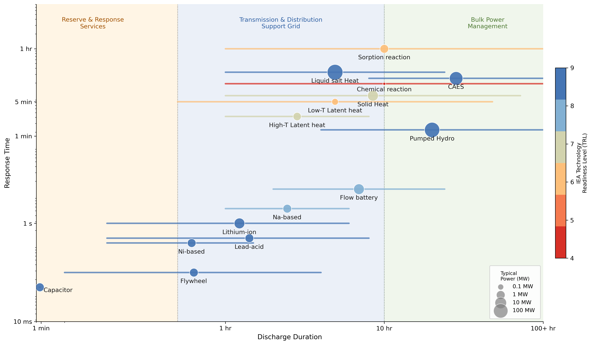

# US Grid Energy Storage
This repository analyzes US Grid energy storage projects and state-level energy storage policies. In brief, I wonder **how state ES policies have affected not only the bulk capacity of ES installed, but also what type of ES technology installed**. I will first introduce grid energy storage, different types of ES technology, and why it matters to differentiate these technologies. I will then summarize state-level energy storage policies. I will follow by describing the current status of grid ES projects in US, using EIA 860 form and GESDB data to analyze the trend and types of ES installation, and finally, I will end with a brief discussion of how these state policies have affected ES installation.

Linkage between output figures and python codes:
- [tech_landscape.py](tech_landscape.py) uses [tech_landscape_manual.csv](Data\tech_landscape_manual.csv) to create:
	- [Tech_landscape.png](Figures\Tech_landscape.png)
- [policy.py](policy.py) uses [policy.csv](Data\policy.csv) and [tl_2024_us_state.zip](Data\tl_2024_us_state.zip) to create:
	- [Policy_map.png](Figures\Policy_map.png)
- [installation.py](installation.py) uses all zipfiles under the "Data\EIA\860" folder to create:
	- [renewable_panel.csv](Data\renewable_panel.csv)
	- [ES_install_trend.png](Figures\ES_install_trend.png)
	- [ES_install_sector.png](Figures\ES_install_sector.png)
- [map.py](map.py) uses [GESDB_Project_Data_full.csv](Data\GESDB\GESDB_Project_Data_full.csv), [renewable_panel.csv](Data\renewable_panel.csv), and [tl_2024_us_state.zip](Data\tl_2024_us_state.zip) to create: 
	- [GESDB_Duration.png](Figures\GESDB_Duration.png)
	- [Installation_map.png](Figures\Installation_map.png)
	- [Service_heatmap.png](Figures\Service_heatmap.png)
	- [Projects_policy_map.png](Figures\Projects_policy_map.png)
## What is grid energy storage?

The electric grid operates under a delicate balance of electricity supply and demand. Unlike most commodities, electricity cannot be stored in a warehouse. It must be generated and consumed almost simultaneously. This makes real-time coordination between generators and end users essential to keeping the grid stable.

Electricity demand fluctuates with daily life routines and weather conditions. It peaks on hot summer afternoons when air conditioners run at full capacity, and drops in the early morning hours when most economic activity is idle. Sudden cold snaps, or large-scale events that shift millions of schedules at once, can cause sharp, rapid swings in consumption.

Electricity supply fluctuates as well. Generation from conventional thermal plants can be adjusted, but ramping up and down takes time, and they are subject to unexpected outages. Renewable energy introduces additional variability: solar output drops to zero after sunset, and wind generation falls when wind speeds are low or too high (see the famous [duck curve](https://blog.gridstatus.io/caiso-solar-storage-spring-2025/)). As the renewable share of the generation mix grows, supply-side variability becomes an increasing challenge for grid operators.

In an electricity market without grid energy storage, balancing supply and demand is an active and costly process. In regulated markets, vertically integrated utilities manage this directly by dispatching their own generation fleet, keeping some capacity on standby as spinning reserves and adjusting output in real time as demand shifts. In restructured markets, ISOs and RTOs coordinate across many generators through day-ahead and real-time energy markets, and procure ancillary services such as frequency regulation and spinning reserves to handle short-term imbalances. Both approaches work, but they are costly. Keeping backup capacity online burns fuel even when its output is not needed, and curtailing excess renewable generation wastes energy that has already been produced.

Grid energy storage is like the warehouse for the electric grid. It can store electricity during periods of high production and low demand, then release it back during periods of low production or higher demand. The merits of this function are straightforward. First, it provides **economic benefits** by avoiding curtailment, such that renewables can operate at full capacity and the energy they produce is not wasted, and by reducing the need for peaker plants that run only a few hours a year to meet peak demand. Second, it improves **grid reliability** by responding within milliseconds to sudden imbalances between supply and demand, providing frequency regulation and voltage support. Third, it enhances **operational flexibility** by giving grid operators the ability to ramp supply up or down quickly in response to changing conditions, reducing dependence on slower-responding thermal generators. Finally, by enabling higher penetration of renewable energy, storage also delivers **environmental benefits** in the form of lower greenhouse gas emissions from the power sector.

## Grid energy storage technologies

Grid energy storage is not one specific technology. It consists of [a myriad of storage technologies](https://css.umich.edu/publications/factsheets/energy/us-grid-energy-storage-factsheet). Each technology, given its technical nature, can deliver specific grid functions. Two key technical characteristics determine which grid services a storage technology can provide: **response time** and **discharge duration**. Response time refers to how quickly a technology can begin delivering power after receiving a signal, while discharge duration refers to how long it can sustain output at rated power.

Different grid services have different demands for these two characteristics. **Reserve and response services**, such as frequency regulation and voltage support, require technologies that can respond within milliseconds to seconds, but only need to sustain output for seconds to minutes. **Transmission and distribution support**, including peak shaving and enabling higher renewable penetration, requires technologies that can respond within seconds to minutes and sustain output for hours. **Bulk power management**, which involves shifting large amounts of energy across hours or days, places less emphasis on response speed but requires technologies capable of discharging for many hours or even days at very large power scales.

The two technical characteristics are generally bounded by the form of energy that is being stored. **Electrical** storage technologies, such as capacitors, store energy in electric or magnetic fields and can discharge almost instantaneously, but hold only small amounts of energy. **Electrochemical** technologies, such as lithium-ion and flow batteries, store energy through reversible chemical reactions, responding within milliseconds to seconds and sustaining output for minutes to hours. **Thermal** storage technologies store energy as heat and are constrained by the time required to transfer heat through a working fluid, resulting in slower response times but potentially longer discharge durations. **Mechanical** technologies convert electricity into kinetic or potential energy. Flywheels respond quickly but store little energy, while pumped hydro and compressed air storage (CAES) can hold enormous amounts of energy but require minutes to reach full output.

I mapped 14 energy storage technologies along these two technical dimensions in Figure 1. I referred to the [IEA Energy Storage Technology Collaboration Programme](https://iea-es.org/energy-storage-technologies/), the [DOE Long-Duration Storage Shot Technology Strategy Assessments](https://www.energy.gov/oe/storage-innovations-2030), and the [PNNL Energy Storage Cost and Performance Database](https://www.pnnl.gov/projects/esgc-cost-performance) for the response time, discharge duration, and typical rated power of the technologies; I also referred to the [IEA ETP Clean Energy Technology Guide](https://www.iea.org/data-and-statistics/data-tools/etp-clean-energy-technology-guide) for technology readiness levels in 2023. Raw code in "tech_landscape.py".

Figure 1: Types of Energy Storage Technology
  

As we can see from the figure, there is no single technology that covers the full range of grid services. At the fast-response end of the spectrum are mainly electrical and electrochemical technologies, while the long-duration end is dominated by mechanical, thermal and thermochemical technologies. This complementarity suggests that a portfolio of technologies, rather than any single solution, will be needed to meet the full range of grid service requirements as renewable penetration increases. 

There is a gap between what technology is matured enough for the market, and what technology we need for inter-day, multi-day, and even cross-seasonal long-duration energy storage (LDES). This is particularly important since mature long-term storage solutions like compressed air and pumped hydro are highly limited by geological conditions. Thermal technologies have smaller scale, remain less mature, and are mainly used in residential buildings. That said, more mobile and flexible alternatives must come from electrochemical or thermochemical storage technologies. Chemical storage technologies, as I plotted above, are still at lab-scale and far from commercialization. Lithium-ion batteries, the most commonly used type of electrochemical storage technology thanks to the growth of EV, mainly serve short-duration peak-shavings for up to 4 hours. Flow battery is one of the only few electrochemical solutions that can be used for inter-day or multiday storage, yet it is also one that is less mature among the electrochemical family. In other words, we need more innovation in LDES technologies to reduce technical uncertainty and to bring the cost down.

Research in innovation policies have long realized that technology-neutral demand-side policies will induce adoption of the most mature, cheapest technology on the market. In our case, this would be Li-ion battery for most places without CAES and hydro resources. While a general, technology-neutral policy on energy storage might speed up the adoption of Li-batteries, it may also crowd out the investments for less-mature LDES. In the next section, I will summarize state-level energy storage policies in the US.

## State energy storage policies

Before going into state-level policies, it is worth reviewing the structure of US electricity market and the the few federal energy storage policies.

The US electricity market is not a single unified market. It is a patchwork of regulated and restructured markets. In regulated markets, vertically integrated utilities own generation, transmission, and distribution, and rates are set by state public utility commissions. In restructured markets, generation has been separated from transmission and distribution, and wholesale electricity is traded competitively through regional transmission organizations (RTOs) or independent system operators (ISOs) such as PJM, CAISO, and MISO. The Federal Energy Regulatory Commission (FERC) is the federal agency that regulates the transmission and wholesale sale of electricity across states. FERC has jurisdiction over wholesale electricity markets and interstate transmission, while states retain authority over retail electricity sales and distribution. This division of authority means that energy storage policy is shaped by both federal and state action.

At the federal level, FERC's limited authority over utilities means that federal energy storage policy is largely limited to two approaches: Market access reform, and supply-side financial incentives. On the market access side, [FERC Order 841](https://www.ferc.gov/media/order-no-841) in 2018 required grid operators to remove barriers preventing storage from participating in wholesale capacity, energy, and ancillary service markets. [FERC Order 2222](https://www.ferc.gov/media/ferc-order-no-2222-fact-sheet) in 2020 went further by allowing distributed storage resources to aggregate and compete in wholesale markets. These orders removed the barriers for storage to capture value from grid services, but they do not directly drive procurement or installation. On the incentive side, the Inflation Reduction Act was meant to make standalone storage facilities eligible for investment tax credits, though the future of IRA tax credits remains uncertain under the current administration.

That said, with the fragmented nature of the market and uncertain federal climate policies, states are the ones with the authority (and increasingly, the ambition) to promote energy storage. [Twitchell (2019)](https://doi.org/10.1007/s40518-019-00128-1) identifies five types of state storage policy: Procurement policy, regulatory adaptation (e.g., interconnection rules and market participation rules that allow storage to provide multiple grid services), demonstration programs, financial incentives (state-level investment tax credits, rebates, and grants), and consumer protection measures (e.g., net metering reforms enabling behind-the-meter storage to participate in retail markets).

I mapped these five types of state policies in Figure 2. Unfortunately, there isn't a publicly available database for energy storage technologies. [Database of State Incentives for Renewables & Efficiency® - DSIRE](https://dsireusa.org/) has state incentives for renewables, which also covers energy storage policies, but it requires a paid API to access full content. PNNL use to have an Energy Storage Policy Database, but the website has been down. I manually collected the policies by 2024 from the [Clean Energy States Alliance](https://www.cesa.org/projects/energy-storage-policy-for-states/table-of-state-targets/) and a [Morgan Lewis report](https://www.morganlewis.com/pubs/2025/03/state-by-state-an-updated-roadmap-through-the-current-us-energy-storage-policy-landscape#_ftn6).

Figure 2: State Energy Storage Policies
  

As of 2024, approximately half of US states have adopted at least one form of energy storage policy. As Figure 2 shows, different states are adopting different policies. Procurement targets, the most direct form of demand-pull policy, have been adopted by 13 states, while regulatory requirements, which mandate that utilities incorporate storage into integrated resource plans, are the most widespread, covering roughly 20 states. Demonstration programs and financial incentives are limited to a handful of states, and consumer protection measures have only been adopted by Nevada and Colorado.

At first glance, the geographic distribution of procurement targets seems to reflect a familiar pattern: states that are generally more ambitious on climate policy, such as California, New York, and Massachusetts, are also the most active on energy storage. However, a closer look suggests that market structure may be a more important driver than political ideology. (Also with a quick glimpse, it doesn't seem that states with higher renewable penetration are more likely to have an ES policy.)

Of the 13 states with procurement targets, 12 are restructured markets. Only Nevada operates a regulated markets. In restructured markets, storage resources can participate in multiple revenue streams across capacity, energy, and ancillary service markets, making procurement targets easier to justify economically. In regulated markets, where utilities recover costs through rate cases rather than market revenues, the economic case for storage procurement is harder to make, and it adds administrative burdens to state PUCs. Financial incentives show a similar pattern, with all four states that have financial incentive programs operating in restructured markets.

Regulated markets, however, seem to prefer regulatory requirements and consumer protection measures. These policy types impose lower administrative burdens on state PUCs. Requiring utilities to consider storage in their integrated resource plans does not mandate actual procurement, and consumer protection legislation simply establishes customer rights without requiring the commission to actively manage a procurement or subsidy process. This pattern suggests that regulated states are not indifferent to energy storage, but they face higher institutional barriers to adopting the more demanding forms of policy that directly drive deployment.

The cost-sharing mechanisms for procurement might also differ across regulated and restructured markets, which might affect how these policies influence the adoption and innovation of different grid energy storage technologies. In regulated markets, the typical pathway is that after the state legislature or public utility commission (PUC) adopts a procurement policy, the PUC requires regulated utilities to include energy storage in their integrated resource plans (IRPs), the IRP is approved and costs are recovered through retail rates, and the utility then procures qualifying storage from suppliers. In this pathway, the adopting utility has little incentive to innovate. It will rationally select the least-cost technology that satisfies the mandate. This creates demand-pull innovation incentives for energy storage suppliers competing to become that least-cost option.

In restructured markets, two pathways might co-exist. In the first, the state energy agency issues a competitive solicitation for storage projects, independent power producers (IPPs) or developers bid, and winning bidders build the project and recover revenue through contracted payments. In the second, transmission and distribution utilities include energy storage in their IRPs, following a pathway similar to the regulated market case.

In both market structures, however, procurement policies are largely technology-neutral. They specify how much storage to procure, but not what kind. As I argued in the technology landscape section, this creates a strong incentive to select the least-cost, most mature technology available, which in practice means lithium-ion batteries. In the next section, I analyze the current status of grid energy storage deployment in the US.
## Current status of grid energy storage in the US

Figure 3 uses data from the [Form 860 from the U.S. Energy Information Administration](https://www.eia.gov/electricity/data/eia860/), which requires all utility-scale electricity generators to annually report their energy storage capacity, technology type, operating status, and ownership information. I use the energy storage table of Form 860 from 2016 to 2024 to construct a state-year panel of installed grid-scale energy storage capacity, by technology type and ownership type. I use the renewable energy generation table of Form 860 to track the growth of wind and solar capacity over the same period. I focus on nameplate energy capacity (MWh) as the primary measure of storage deployment, since it captures the amount of energy a system can store and deliver, which is more relevant to grid service provision than power capacity (MW) alone.

Figure 3a: Trend of energy storage installed capacity
  

As Figure 3a shows, US grid-scale energy storage capacity grew rapidly between 2016 and 2024, from under 1,000 MWh to over 70,000 MWh. This increase is particularly steep after 2020, coinciding with both the IRA and the continued decline in lithium-ion battery costs. Notably, this growth tracks closely with the expansion of wind and solar capacity over the same period. This parallel growth is consistent with the argument that storage deployment is driven in part by the need to balance variable renewable output.

The change in technology composition echoes exactly with my earlier crowding-out story. In 2016, the installed base was relatively diverse, with compressed air, flywheels, and other battery types accounting for a significant share. By 2020, lithium-ion had become dominant, and by 2024 it accounts for nearly all new installations. It is obvious that the rapid growth is brought about by lithium-ion batteries, and this least-cost technology crowded out alternatives. Flow batteries and other LDES candidates, despite their technical suitability for longer-duration applications, have not gained meaningful market share.

Figure 3b: Energy storage installed capacity, by plant ownership
  

Figure 3b breaks down installed capacity by ownership type and technology mix. IPPs account for the majority of installed capacity, and their share has grown over time, potentially as competitive procurement in restructured markets accelerated deployment. Electric utilities contribute a smaller but meaningful share. Commercial and industrial installations remain negligible at the grid scale, which primarily consists of institutional and industrial users, such as universities and hospitals, that operate their own on-site storage systems for self-consumption rather than grid supply.

The technology composition across sectors also speaks to the crowding-out story. Lithium-ion batteries dominate all sectors, with probably only electric utilities as the exception. There is still a visible share of compressed air, flow batteries, and other technologies from the electric utilities. This pattern makes sense. Electric utilities in regulated markets must fulfill the IRP requirements, such that utilities must demonstrate long-term resource adequacy across multiple grid services, which involve a broader range of storage technologies. In contrast, IPPs operating in competitive markets face stronger pressure to minimize costs and select the cheapest available option.

To examine the technology and service composition of installed storage projects in more detail, I turn to the [DOE Global Energy Storage Database (GESDB)](https://gesdb.sandia.gov/), which tracks individual grid-connected storage projects worldwide and includes project-level information on discharge duration and, most importantly, grid service type. GESDB has not been updating since 2022, which is why I did not use it for the trend analysis above. However, it still provides a valuable link between technology types and grid services.

Figure 4: Discharge duration of operational storage projects, by technology
  

Figure 4 shows the distribution of discharge duration across operational US storage projects in GESDB. The overall distribution is heavily skewed toward short durations: the majority of projects discharge in under 4 hours, with most around 1 to 2 hours. Very few projects exceed the 10-hour LDES threshold.

The breakdown by technology on the right explains the pattern by showing how different technologies, in practice, varies in discharge duration. The distribution mostly corresponds to their theoretical performances in Figure 1. Flywheels and electro-chemical capacitors sit at the very short end, consistent with their role in reserve and response services. Lithium-ion batteries cluster around 4 hours. Flow batteries and sodium-based batteries have slightly higher medians, but still far from the LDES threshold despite their theoretical capability of having longer duration. Pumped hydro and compressed air are the only technologies with medians near or above the LDES threshold, but as we saw earlier, these are geologically constrained and cannot be deployed everywhere. (Haven't figured out why this is the case for Nickel-based battery yet, but it might just reflect a small number of older projects.)

Figure 5: Project count by service and technology type
  

Figure 5 shows the number of projects by technology and grid service type across operational US storage projects in GESDB, with services grouped into the same three categories from Figure 1 based on GESDB's own classification of services.

One notable pattern is the large number of latent heat projects in Retail TOU Energy Charges and Operating Reserve categories. However, I checked that these are almost all commercial building ice storage and chilled water systems rather than grid-scale power storage. GESDB captures a broader range of storage technologies than the utility-scale sector alone, and latent heat numbers in particular should be interpreted with caution.

Another counter-intuitive pattern is that lithium-ion batteries dominate the Bulk Power Management category, even though Figure 1 suggested that bulk services require longer discharge durations that lithium-ion cannot provide. There are a few possible explanations. First, GESDB's service labels are self-reported by project developers, who may label short-duration daily arbitrage as "electric energy time shift" without distinguishing it from true multi-day bulk storage. Second, GESDB's "Bulk Energy Services" category is broader than the Bulk Power Management concept in Figure 1. It includes intra-day arbitrage, which lithium-ion can handle within its 4-hour discharge window. Third, and perhaps most interestingly, this pattern may itself reflect the crowding-out dynamic. In markets where bulk services are compensated, developers deploy the cheapest available technology to capture intra-day price variations, rather than investing in genuine long-duration storage.

That said, flywheels and lead-acid batteries also appear in the Reserve & Response category, reflecting their fast-response capabilities. The project counts here are smaller overall, which is consistent with the fact that frequency regulation and operating reserve markets are smaller and more technically demanding than energy arbitrage markets. We can also see that less mature technologies like flow battery and sodium-based battery are aiming mostly for longer-duration services.

## Discussion

Although I do not plan to conduct any regressional analysis for this project, I might use one to examine how state energy policies affect energy storage adoption and innovation. Nevertheless, I provide a bird-eye view of how likely it is that these state policies have an effect on energy storage installation. Figure 6 overlays grid-scale energy storage projects from GESDB (as of 2022) onto the state policy map from Figure 2. Storage projects are more concentrated in states with energy storage policies, particularly along the Northeast and in California. This is consistent with the argument that procurement targets and other demand-pull policies drive deployment. Second, pumped hydro projects, shown as large green circles, are distributed across both policy and non-policy states, reflecting their dependence on geography rather than policy. Third, lithium-ion projects, shown as small blue dots, are mostly concentrated in California and the Northeast, which are the states with the most aggressive procurement targets. In contrast, LDES-capable technologies like flow batteries and compressed air remain sparse and scattered, with no obvious clustering around policy states. 

That said, the map also shows meaningful storage activity in non-policy states, particularly in the Southeast and Texas. This suggests that market conditions (growing demand and renewables) and ISO/RTO rules might also drive deployment independent of state storage policy.

Figure 6: Project location by technology type, on policy map
  

